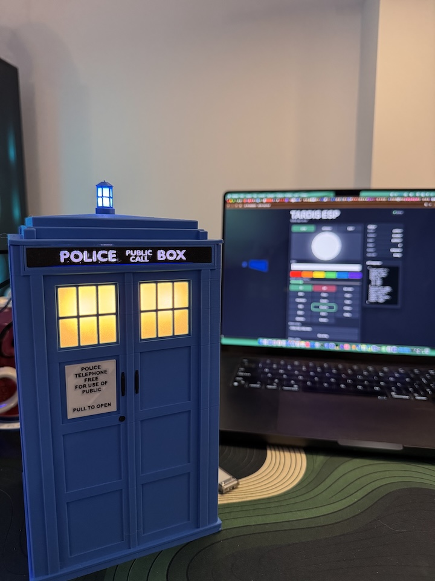
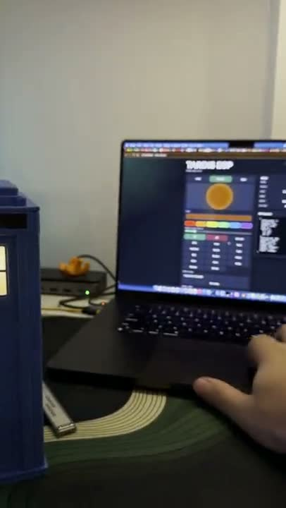
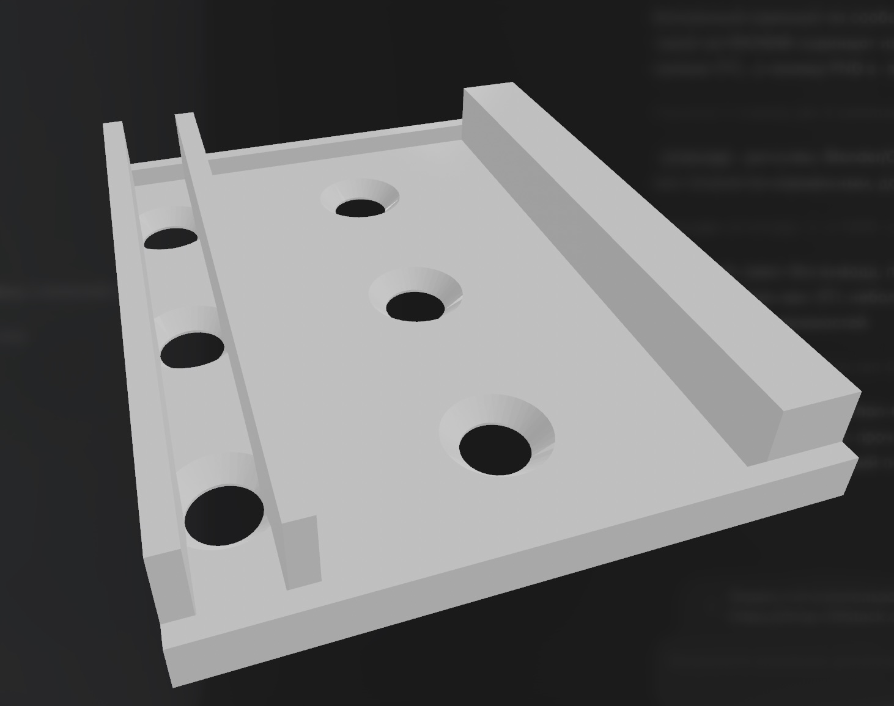

# TARDIS ESP

MicroPython firmware for an illuminated printed TARDIS book nook based on this model:

[TARDIS Book Nook Illuminable on MakerWorld](https://makerworld.com/ru/models/2256627-tardis-book-nook-illuminable)

The project runs on an ESP32-C3 and controls SK6812/NeoPixel RGB light zones through a small local HTTP API and browser UI.



[](media/demo/tardis-demo-720p.mp4)

[Watch demo video (MP4, no audio)](media/demo/tardis-demo-720p.mp4)

## Components

- [M5Stamp C3](https://shop.m5stack.com/products/m5stamp-c3-5pcs) as the ESP32-C3 controller.
- [SK6812 RGB LEDs](https://www.amazon.es/dp/B0DR8KD4DR?ref=ppx_yo2ov_dt_b_fed_asin_title) for the TARDIS light zones.

## Current Hardware Layout

Configured light zones:

| Zone | Purpose | GPIO | Pixels |
| --- | --- | --- | --- |
| `lamp` | Top TARDIS lamp | `GPIO10` | `1` |
| `windows` | Window lights | `GPIO8` | `3` |
| `signs` | `POLICE PUBLIC CALL BOX` signs | `GPIO7` | `3` |

Other configured pins:

| Pin | Purpose |
| --- | --- |
| `GPIO2` | Reserved auxiliary SK6812 object |
| `GPIO3` | Button input with pull-up |

## Printed Parts

The base TARDIS model is linked above. This repository also includes a custom printed LED support part for positioning the `windows` and `signs` LEDs:



- [`hardware/led_support.stl`](hardware/led_support.stl)

## Setup

### MicroPython Firmware

This project was tested with this MicroPython ESP32-C3 firmware image:

- [`firmware/ESP32_GENERIC_C3-20260406-v1.28.0.bin`](firmware/ESP32_GENERIC_C3-20260406-v1.28.0.bin)
- Source family: [MicroPython ESP32_GENERIC_C3](https://micropython.org/download/ESP32_GENERIC_C3/)

This firmware is only for ESP32-C3 boards, such as the M5Stamp C3 used here. Do not flash this binary to other ESP32 variants. For ESP32, ESP32-S2, ESP32-S3, ESP32-C6, or another controller, download the matching MicroPython build for that exact board/chip and follow its own flashing offset instructions.

Basic `esptool` install command:

```sh
python3 -m pip install esptool
```

Erase the board first:

```sh
esptool.py --port /dev/cu.usbmodemXXXX erase_flash
```

Flash the ESP32-C3 firmware. For `ESP32_GENERIC_C3`, the firmware starts at address `0`:

```sh
esptool.py --port /dev/cu.usbmodemXXXX --baud 460800 write_flash 0 firmware/ESP32_GENERIC_C3-20260406-v1.28.0.bin
```

Replace `/dev/cu.usbmodemXXXX` with the serial port of your board. On macOS it is usually similar to `/dev/cu.usbmodem*` or `/dev/cu.usbserial-*`; on Linux, `/dev/ttyUSB*` or `/dev/ttyACM*`; on Windows, `COM4` or another COM port.

If flashing fails partway through, retry without `--baud 460800` to use the slower default speed.

### Project Files

Edit Wi-Fi placeholders in `config.py` before uploading to the board:

```python
WIFI_SSID = "YOUR_WIFI_SSID"
WIFI_PASSWORD = "YOUR_WIFI_PASSWORD"
```

Upload the project files to the ESP32-C3 filesystem, including:

- `main.py`
- `boot.py`
- all helper `.py` modules
- `index.html`

On boot, the firmware:

1. Loads saved LED state from `led_state.json`.
2. Runs a startup animation that does not save state:
   - windows fade into dim orange;
   - signs flicker and settle to white;
   - top lamp flashes twice.
3. Connects to Wi-Fi.
4. Starts the HTTP server.
5. Restores saved zone modes.

Default hostname:

```text
http://tardis-esp.local/
```

If `.local` is unavailable, use the IP printed in the serial console.

## Web UI

Open the ESP in a browser:

```text
http://tardis-esp.local/
```

The UI supports:

- zone selection: `lamp`, `windows`, `signs`;
- solid colors;
- blink and pulse modes;
- built-in patterns;
- custom pattern strings;
- custom JSON patterns;
- live state display.

## API Overview

The API is zone-only. Use `/api/zones/{zone}/...`, where `{zone}` is one of:

- `lamp`
- `windows`
- `signs`

Read all zones:

```sh
curl http://tardis-esp.local/api/zones
```

Read one zone:

```sh
curl http://tardis-esp.local/api/zones/lamp/state
```

Turn a zone off:

```sh
curl http://tardis-esp.local/api/zones/lamp/off
```

Set solid color:

```sh
curl "http://tardis-esp.local/api/zones/lamp/color?hex=00a3ff"
```

Blink:

```sh
curl "http://tardis-esp.local/api/zones/lamp/blink?hex=ff0000&interval=300"
```

Pulse:

```sh
curl "http://tardis-esp.local/api/zones/lamp/pulse?hex=00a3ff&period=1500"
```

Run a built-in pattern:

```sh
curl "http://tardis-esp.local/api/zones/lamp/pattern?name=glitch&hex=ff7a00"
```

Available built-in patterns:

```text
flash, heartbeat, double, triple, sos, breathe, flicker, glitch, alarm, notify, rainbow, wifi
```

Run a compact custom pattern:

```sh
curl "http://tardis-esp.local/api/zones/lamp/custom?hex=ff0000&unit=150&pattern=100101110"
```

Run a timed custom pattern:

```sh
curl "http://tardis-esp.local/api/zones/lamp/custom?hex=00a3ff&pattern=1:120,0:120,1:120,0:800"
```

Run a JSON custom pattern:

```sh
curl -X POST http://tardis-esp.local/api/zones/lamp/custom \
  -H "Content-Type: application/json" \
  -d '{
    "name": "soft-blue",
    "repeat": true,
    "steps": [
      { "color": "#001133", "ms": 400, "fade": true },
      { "color": "#00a3ff", "ms": 900, "fade": true },
      { "color": "#000000", "ms": 700, "fade": true }
    ]
  }'
```

Full API documentation:

- [`docs/API.md`](docs/API.md)
- [`docs/openapi.yaml`](docs/openapi.yaml)

## Media

Use these folders for README assets:

- `media/photos/` for photos of the printed model and wiring.
- `media/screenshots/` for browser UI screenshots.

The folders include `.gitkeep` placeholders so they are present in the repository before media files are added.
