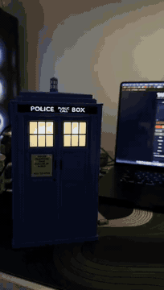
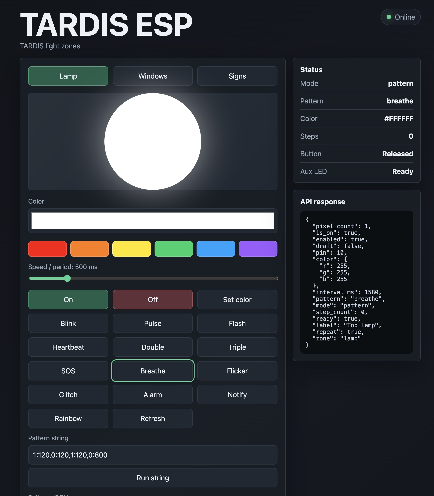

# TARDIS ESP

Прошивка на MicroPython для печатного TARDIS book nook с подсветкой, основанного на этой модели:

[TARDIS Book Nook Illuminable на MakerWorld](https://makerworld.com/ru/models/2256627-tardis-book-nook-illuminable)

Проект работает на ESP32-C3 и управляет зонами RGB-подсветки SK6812/NeoPixel через простой локальный HTTP API и веб-интерфейс.




[Смотреть полное демо-видео (MP4, без звука)](media/demo/tardis-demo-720p.mp4)

## Компоненты

- [M5Stamp C3](https://shop.m5stack.com/products/m5stamp-c3-5pcs) как контроллер ESP32-C3.
- [RGB-светодиоды SK6812](https://www.amazon.es/dp/B0DR8KD4DR?ref=ppx_yo2ov_dt_b_fed_asin_title) для зон подсветки TARDIS.

## Текущая схема подключения

Настроенные зоны подсветки:

| Зона | Назначение | GPIO | Пиксели |
| --- | --- | --- | --- |
| `lamp` | Верхний фонарь TARDIS | `GPIO10` | `1` |
| `windows` | Подсветка окон | `GPIO8` | `3` |
| `signs` | Надписи `POLICE PUBLIC CALL BOX` | `GPIO7` | `3` |

Другие настроенные пины:

| Пин | Назначение |
| --- | --- |
| `GPIO2` | Зарезервированный вспомогательный объект SK6812 |
| `GPIO3` | Кнопка с подтяжкой к питанию |

## Печатные детали

Базовая модель TARDIS указана выше. В репозитории также есть кастомная печатная деталь для позиционирования светодиодов зон `windows` и `signs`:


- [`hardware/led_support.stl`](hardware/led_support.stl)

## Установка

### Прошивка MicroPython

Проект проверялся с этим образом MicroPython для ESP32-C3:

- [`firmware/ESP32_GENERIC_C3-20260406-v1.28.0.bin`](firmware/ESP32_GENERIC_C3-20260406-v1.28.0.bin)
- Семейство прошивки: [MicroPython ESP32_GENERIC_C3](https://micropython.org/download/ESP32_GENERIC_C3/)

Эта прошивка подходит только для плат ESP32-C3, например для используемой здесь M5Stamp C3. Не прошивайте этот бинарник в другие варианты ESP32. Для ESP32, ESP32-S2, ESP32-S3, ESP32-C6 или другого контроллера скачайте подходящую сборку MicroPython именно для этой платы или чипа и используйте указанный для нее offset прошивки.

Базовая команда установки `esptool`:

```sh
python3 -m pip install esptool
```

Сначала очистите память платы:

```sh
esptool.py --port /dev/cu.usbmodemXXXX erase_flash
```

Прошейте firmware для ESP32-C3. Для `ESP32_GENERIC_C3` прошивка начинается с адреса `0`:

```sh
esptool.py --port /dev/cu.usbmodemXXXX --baud 460800 write_flash 0 firmware/ESP32_GENERIC_C3-20260406-v1.28.0.bin
```

Замените `/dev/cu.usbmodemXXXX` на serial-порт вашей платы. На macOS он обычно похож на `/dev/cu.usbmodem*` или `/dev/cu.usbserial-*`; на Linux - `/dev/ttyUSB*` или `/dev/ttyACM*`; на Windows - `COM4` или другой COM-порт.

Если прошивка обрывается в процессе, повторите команду без `--baud 460800`, чтобы использовать более медленную стандартную скорость.

### Файлы проекта

Перед загрузкой на плату отредактируйте Wi-Fi placeholder-значения в `config.py`:

```python
WIFI_SSID = "YOUR_WIFI_SSID"
WIFI_PASSWORD = "YOUR_WIFI_PASSWORD"
```

Загрузите файлы проекта в файловую систему ESP32-C3, включая:

- `main.py`
- `boot.py`
- все вспомогательные `.py` модули
- `index.html`

При загрузке прошивка:

1. Загружает сохраненное состояние светодиодов из `led_state.json`.
2. Запускает стартовую анимацию, которая не сохраняется как пользовательское состояние:
   - окна плавно загораются неярким оранжевым;
   - надписи мерцают как неисправная лампа и затем стабилизируются в белый;
   - верхний фонарь дает две яркие вспышки.
3. Подключается к Wi-Fi.
4. Запускает HTTP-сервер.
5. Восстанавливает сохраненные режимы зон.

Адрес по умолчанию:

```text
http://tardis-esp.local/
```

Если `.local` недоступен, используйте IP-адрес, напечатанный в serial-консоли.

## Веб-интерфейс

Откройте ESP в браузере:

```text
http://tardis-esp.local/
```

Интерфейс поддерживает:

- выбор зоны: `lamp`, `windows`, `signs`;
- сплошные цвета;
- режимы blink и pulse;
- встроенные паттерны;
- кастомные строковые паттерны;
- кастомные JSON-паттерны;
- отображение текущего состояния.



## Обзор API

API управления светом работает только через зоны. Используйте `/api/zones/{zone}/...`, где `{zone}` - одно из значений:

- `lamp`
- `windows`
- `signs`

Прочитать все зоны:

```sh
curl http://tardis-esp.local/api/zones
```

Прочитать диагностику памяти:

```sh
curl http://tardis-esp.local/api/system
```

Прочитать одну зону:

```sh
curl http://tardis-esp.local/api/zones/lamp/state
```

Выключить зону:

```sh
curl http://tardis-esp.local/api/zones/lamp/off
```

Задать сплошной цвет:

```sh
curl "http://tardis-esp.local/api/zones/lamp/color?hex=00a3ff"
```

Моргание:

```sh
curl "http://tardis-esp.local/api/zones/lamp/blink?hex=ff0000&interval=300"
```

Плавная пульсация:

```sh
curl "http://tardis-esp.local/api/zones/lamp/pulse?hex=00a3ff&period=1500"
```

Запустить встроенный паттерн:

```sh
curl "http://tardis-esp.local/api/zones/lamp/pattern?name=glitch&hex=ff7a00"
```

Доступные встроенные паттерны:

```text
flash, heartbeat, double, triple, sos, breathe, flicker, glitch, alarm, notify, rainbow, wifi
```

Запустить компактный кастомный паттерн:

```sh
curl "http://tardis-esp.local/api/zones/lamp/custom?hex=ff0000&unit=150&pattern=100101110"
```

Запустить кастомный паттерн с длительностями:

```sh
curl "http://tardis-esp.local/api/zones/lamp/custom?hex=00a3ff&pattern=1:120,0:120,1:120,0:800"
```

Запустить кастомный JSON-паттерн:

```sh
curl -X POST http://tardis-esp.local/api/zones/lamp/custom \
  -H "Content-Type: application/json" \
  -d '{
    "name": "soft-blue",
    "repeat": true,
    "steps": [
      { "color": "#001133", "ms": 400, "fade": true },
      { "color": "#00a3ff", "ms": 900, "fade": true },
      { "color": "#000000", "ms": 700, "fade": true }
    ]
  }'
```

Полная документация API:

- [`docs/API_RU.md`](docs/API_RU.md)
- [`docs/openapi.yaml`](docs/openapi.yaml)

## Медиа

Используйте эти папки для README-материалов:

- `media/photos/` для фотографий печатной модели и проводки.
- `media/screenshots/` для скриншотов браузерного интерфейса.

Папки содержат `.gitkeep`, чтобы они присутствовали в репозитории до добавления медиафайлов.
